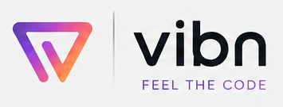

<!-- SUMMONIQ-OSS-HEADER:START -->

  

  <h1>Vibn</h1>
  
Vibn — local AI coding agent. CLI (Rust), desktop (Tauri), marketing site (Next.js).

  

    
    
  

---
<!-- SUMMONIQ-OSS-HEADER:END -->
## Overview

Vibn — local AI coding agent. CLI (Rust), desktop (Tauri), marketing site (Next.js).
